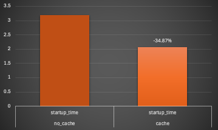
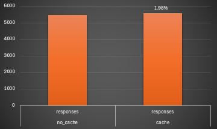
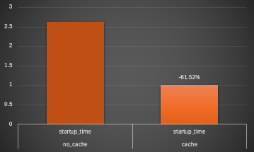
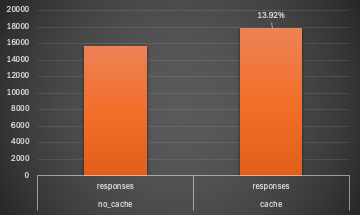

# Scripts & Results

[scripts](.) folder holds short scripts helpful for:
- extracting the fat-jar
- creating and saving the AoT cache
- starting the application using the AoT cache
- running benchmark tests for startup times / requests served

A [runs.xlsx](runs.xlsx) captures the benchmarks for both fat-jar and extracted-jar, and with or without AoT caching.

fat-jar:




extracted jar:




_Executed on a Mac M1 on OracleJDK 25.0.1_

## Build & Run

Pre-requisit: JDK 25

```shell
./mvnw clean package
```

or

```shell
./mvn clean package
```

Then make use of the appropriate [scripts](.).
- Use [fat-jar-to-extracted-jar.sh](./fat-jar-to-extracted-jar.sh) to generate the extracted jar
- Execute a training run `start-and-save-cache.sh` or `start-and-save-cache-fat-jar.sh` and run `benchmark-requests.ch` for stressing the application
- Update the `START_SCRIPT` variable of the `benchmark-multi-run-*.sh` based on the benchmark case (`start-and-load-cache.sh`, `start-and-load-cache-fat-jar.sh`, ...)
